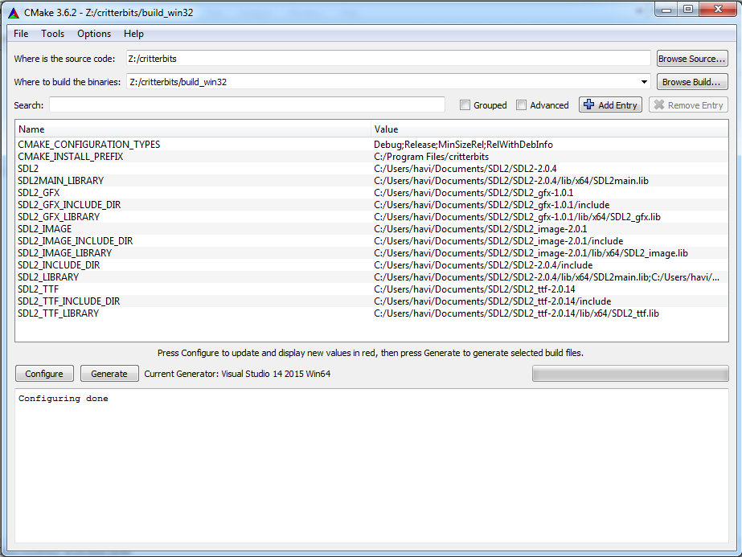

# Building from Source

* [Clone the Repo](#clone-the-repo)
* [Building on Linux with GCC](#building-on-linux-with-gcc)
* [Building on Windows with Visual Studio](#building-on-windows-with-visual-studio)

> This section just deals with building Critterbits itself from source. For distribution and installation of the runtime with your game, see the [distribution](#) section of the documentation.

## Clone the Repo

The first step is getting the source code from the [GitHub repository](https://github.com/taxes-dev/critterbits). This part is easy. You can use the GitHub desktop application if it's available on your system, or you can clone directly from the command line. Here's an example using the command line with SSH:

```
git clone git@github.com:taxes-dev/critterbits.git
```

How to use Git for source control is out of scope for this document. If you need more information, [check out this really simple tutorial](http://rogerdudler.github.io/git-guide/).

## Building on Linux with GCC

Critterbits can be built with GGC 5.0 and above on Ubuntu 16.04 and above, and it supports both 32-bit and 64-bit builds. Other distributions shouldn't be too difficult to support, but here are the instructions for Debian-based systems like Ubuntu.

First, install all the dependencies with `apt` or your favorite package manager.

For building:

```
sudo apt-get install build-essential
sudo apt-get install cmake
sudo apt-get install clang-format-3.8
```

`clang-format-3.8` is optional if you don't run the code format tasks, but a `.clang-format` definition is provided in the repository for you to use.

Also if you need to build 32-bit:

```
sudo apt-get install g++-multilib libc6-dev:i386
```

Lastly you will need multiple SDL2 packages installed:

```
sudo apt-get install libsdl2-2.0-0 libsdl2-dev
sudo apt-get install libsdl2-gfx-1.0-0 libsdl2-gfx-dev
sudo apt-get install libsdl2-image-2.0-0 libsdl2-image-dev
sudo apt-get install libsdl2-ttf-2.0-0 libsdl2-ttf-dev
```

Once all of the dependencies are installed, you can build Critterbits using CMake. Execute this line from the root of the repository:

```
cmake -H. -Bbuild
```

By default I use a subfolder called `build` for the output; this is already ignored by the Git repository.

If you were able to install all the dependencies from your package manager, there shouldn't be any additional configuration required. See the Windows section below if you need to override the locations of the SDL2 libraries.

Now that the makefiles are generated, you can change directory to the `build` folder and execute `make` to build the actual binaries. The Critterbits executable will be in the `build/src` subfolder.

## Building on Windows with Visual Studio

Critterbits can be built with Visual Studio 2015 on Windows 7 and above, and it supports both 32-bit and 64-bit builds. First, you'll need to download the dependencies.

* [Visual Studio 2015 Community Edition](https://www.visualstudio.com/vs/community/) (the full edition works too)
* [CMake 3.3 or later](https://cmake.org/download/) (If you're not familiar with CMake, I recommend using the included CMake GUI tool)
* SDL2 libraries
  * Currently built against 2.0.4, though latest should be fine
  * Download the Windows runtime binaries and development libraries here: [https://www.libsdl.org/download-2.0.php](https://www.libsdl.org/download-2.0.php)
* [SDL_image 2.0.1](https://www.libsdl.org/projects/SDL_image/) (get the runtime binaries and development libraries)
* [SDL_ttf 2.0.14](https://www.libsdl.org/projects/SDL_ttf/) (get the runtime binaries and development libraries)
* [SDL2_gfx 1.0.1](https://sourceforge.net/projects/sdl2gfx/) (build from source)

Additional dependencies are checked into the repository. I also have available a [ZIP archive with all of the Windows SDL dependencies](https://drive.google.com/open?id=0B5BUJeNpcNWkWXl1R0o3OVMwZ3c) if you want to get started quickly.

Once you have all of the dependencies downloaded and installed, startup CMake GUI and open the root folder of the Critterbits repository as the source folder. For the binary folder, I use a subfolder of the repository root called `build_win32` (this is already ignored by the Git repository).

When you first hit "Configure", it will ask what generator you want to use. Choose `Visual Studio 14 2015` if you want the 32-bit build or `Visual Studio 14 2015 Win64` if you want the 64-bit build. You can leave the rest of the options at the default.

When it first tries to generate, likely it will be unable to find all the SDL2 dependencies. You'll need to manually specify those by clicking the "Add Entry" button and adding `PATH` hints one at a time for each dependency.

* `SDL2` - Defines the path to the main SDL2 folder.
* `SDL2_GFX` - Defines the path to the SDL2_gfx folder.
* `SDL2_IMAGE` - Defines the path to the SDL_image folder.
* `SDL2_TTF` - Defines the path to the SDL_ttf folder.

For each one, it expects the `lib` (containing development libraries) and `include` folders to be subfolders of the specified folder.

Here's an example of what it looks like once everything has been configured:



Now you can click "Generate" and this will generate the actual Visual Studio project files. At this point, you should be open the new `critterbits.sln` file that was generated in the binaries folder for you and build it in Visual Studio. Keep in mind that at this point only the Release build works, as I haven't had the time to go through and create debug versions of all the Windows dependencies.

After building you should have the actual executable available under the subfolder `src\Release` of the binaries folder. It won't start on its own, however, as it needs a few of the runtime binaries to be installed alongside. You don't need all of them, though; just copy the following from your SDL2 folders:

* `libfreetype-6.dll`
* `libpng16-16.dll`
* `SDL2.dll`
* `SDL2_gfx.dll`
* `SDL2_ttf.dll`
* `zlib1.dll`

Now you're ready to start creating with Critterbits!

***
[[Back to index](../index.md)]